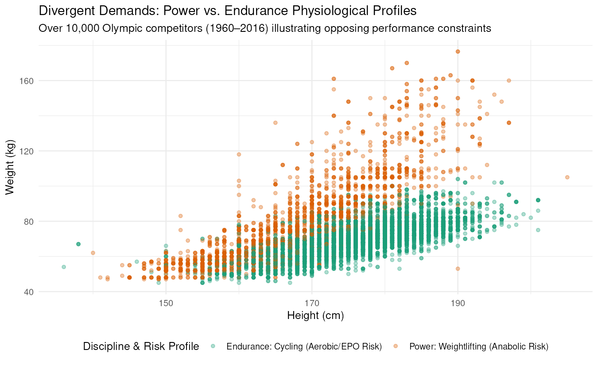

## Two Opposite Physiological Demands

Athletic disciplines place starkly divergent mechanical constraints on the human body. As visualized above across more than 10,000 Olympic competitors between 1960 and 2016, weightlifters and cyclists occupy radically different physiological profiles. Weightlifters cluster heavily toward elevated body mass relative to height, prioritizing absolute cross-sectional muscle area to generate maximal ground-reaction force. In contrast, road and track cyclists cluster tightly within a narrow, lean corridor where extra upper-body mass represents dead weight that increases rolling resistance and aerodynamic drag.

These divergent biomechanical demands directly dictate the pharmacological incentives observed in anti-doping testing. In sports governed by raw power and short bursts of explosive torque—such as weightlifting, sprinting, and throwing—adverse analytical findings (AAFs) reported by the World Anti-Doping Agency (WADA) have historically been dominated by anabolic androgenic steroids (AAS) and human growth hormone (hGH). These substances directly stimulate muscle protein synthesis and accelerate musculoskeletal recovery from heavy resistance strain.

Conversely, in aerobic endurance disciplines like cycling, distance running, and cross-country skiing, performance is capped by VO2 max, cardiac output, and oxygen delivery to slow-twitch muscle fibers. Consequently, performance enhancement in endurance disciplines centers on blood manipulation—including recombinant human erythropoietin (EPO), blood transfusions, and synthetic oxygen carriers. The distinct clustering in the data explains why anti-doping surveillance cannot apply a one-size-fits-all model: the physiological bottleneck of each sport determines the exact substances athletes are incentivized to pursue.
