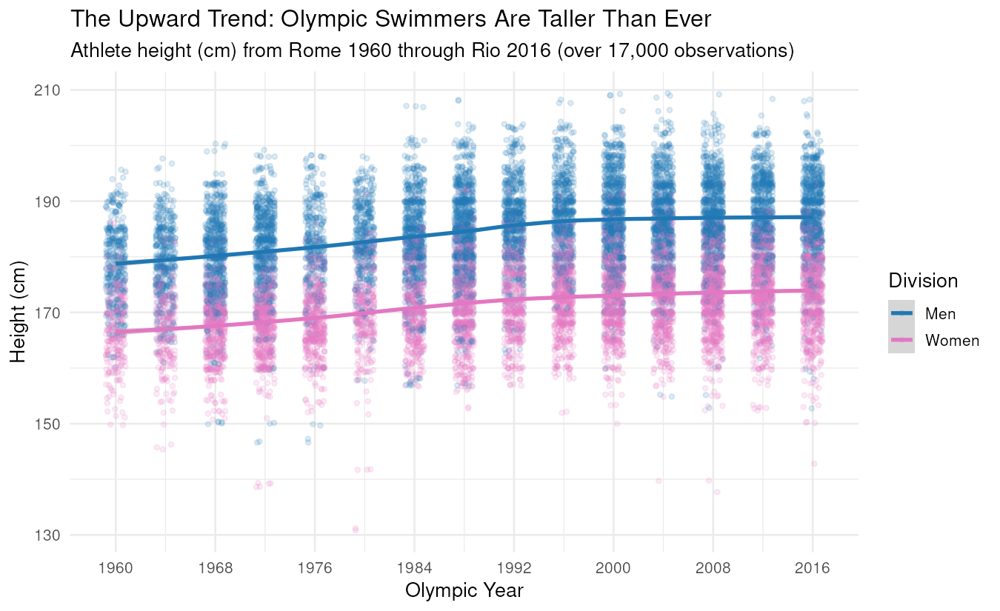

## The Upward Shift Across Modern Games

Over the past six decades, elite competitive swimming has experienced a dramatic morphological shift. The graphic above tracks over 17,000 Olympic swimming competitor records between the 1960 Rome Games and the 2016 Rio Games. In 1960, the average male Olympic swimmer stood approximately 179 cm (5 ft 10 in) and the average female swimmer stood 167 cm (5 ft 6 in). By 2016, those averages rose to nearly 188 cm (6 ft 2 in) and 175 cm (5 ft 9 in), respectively.

This height expansion reflects how competitive advantages in aquatic propulsion compound with stature. Taller swimmers possess larger wingspans and bigger surface areas for hands and feet, which function effectively as larger paddles in the water. Moreover, longer torsos and limbs allow swimmers to begin their strokes further forward and travel further per stroke cycle, reducing drag relative to body mass.

Crucially, this trend accelerated alongside the professionalization of Olympic scouting and specialized dryland training. Rather than swimming being a sport of general endurance, modern national development programs actively recruit athletes with long levers and hyper-mobile joints, shaping the modern Olympic pool into one of the tallest athlete cohorts in international sports.
